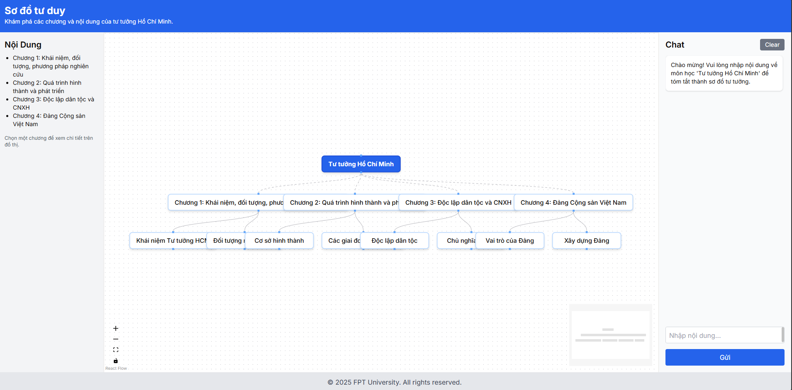

# MindMap App

A tool to generate and visualize mind maps powered by AI. Leverage cutting-edge technology to transform your ideas into dynamic mind maps.




## Overview

MindMap App is built with [Next.js](https://nextjs.org/), [TypeScript](https://www.typescriptlang.org/), and [Tailwind CSS](https://tailwindcss.com/). It integrates with the OpenAI API to generate mind maps in response to user prompts, providing a unique solution for brainstorming and idea management.

## Features

- **AI-Driven Mind Map Generation:** Create mind maps based on natural language prompts.
- **Interactive Visualization:** Experience dynamic nodes and edges.
- **Responsive Design:** Enjoy optimal display on desktops and mobile devices.
- **Secure Environment:** Sensitive configuration is kept out of version control using a properly configured `.gitignore`.

## Getting Started

### Installation

1. **Clone the repository:**

    ```bash
    git clone https://github.com/bluefishhh93/mindmap.git
    ```

2. **Navigate into the project directory:**

    ```bash
    cd mindmap
    ```

3. **Install dependencies:**

    ```bash
    npm install
    ```

4. **Setup Environment Variables:**

    - Copy the example file to create a new `.env`:

      ```bash
      cp .env.example .env
      ```

    - Open the newly created [.env](http://_vscodecontentref_/1) file and add your OpenAI API key:

      ```dotenv
      OPENAI_API_KEY=your_api_key_here
      ```

### Running the App

Start the development server:

```bash
npm run dev